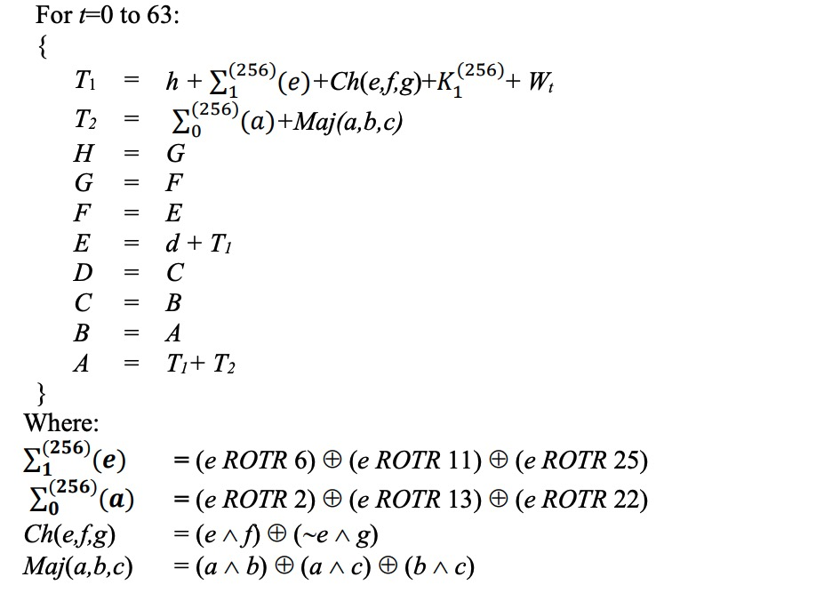

# 实验一


## 实验目的

- 完成SHA256算法实现
- 实现Merkle树的构建
- 搭建简单的区块链结构

## 实验介绍

### SHA256

SHA是安全哈希算法(Secure Hash Algorithm)的缩写，是由美国国家安全局(national Security Agency,NSA)设计、美国国家标准与技术研究院(National institute of Standard and Technology,NIST) 发布的密码学哈希算法组，起家族成员包括SHA-1、SHA-256、SHA384和SHA-512等。

SHA算法具有以下特点：

- 压缩性：任意长度的数据，算出的SHA256值长度都是固定的。
- 容易计算：从原数据计算出SHA256值很容易。
- 抗修改性：对原数据进行任何改动，哪怕只修改1个字节，所得到的SHA256值都有很大区别。
- 强抗碰撞：已知原数据和其SHA256值，想找到一个具有相同SHA256值的数据（即伪造数据）是非常困难的。

对于任意长度的消息，SHA256都会产生一个256位的哈希值，称作消息摘要。这个摘要相当于是个长度为32个字节的数组，通常有一个长度为64的十六进制字符串来表示，其中1个字节=8位，一个十六进制的字符的长度为4位。

#### 算法流程

- 对消息进行填充，先补1个"1"和k个"0"，满足  **(l+1+k) mod 512 = 448**，l代表消息长度

- 附加长度信息，将**消息的长度信息通过64位二进制的形式**补充到原消息后，使得最后的消息长度正好是512的倍数。我们采用**Big endian**对数据进行编码。

- 划分信息，把消息按照512比特一个区块划分到区块$M^{(1)},M^{(2)},...,M^{(N)}$

- 计算扩展消息块，$W_0,W_1,...,W_{63}$，

  具体计算公式为

  

- 初始化变量, a, b, c, d, e, f, g, and h

    SHA256算法选取了前八个素数平方根的小数部分的前面32位,在SHA256算法中为**无符号整数**

  ```
  h0 = 0x6a09e667
  h1 = 0xbb67ae85
  h2 = 0x3c6ef372
  h3 = 0xa54ff53a
  h4 = 0x510e527f
  h5 = 0x9b05688c
  h6 = 0x1f83d9ab
  h7 = 0x5be0cd19
  ```

- 通过上一轮的hash结果，循环计算下一轮的数据,其中**K代表自然数中前面64个素数的立方根的小数部分的前32位，对应每次循环选取对应的K**

  

- 计算中间哈希值

  $H_1^{(i)}\leftarrow a + H_1^{(i-1)}$ ... $H_8^{(i)}\leftarrow h + H_8^{(i-1)}$
  
- 输出结果，把拼接得到结果

  $H_{out} = H_0^{N} || H_1^{N}|| H_2^{N}||H_3^{N}||...||H_7^{N}$
  
  

### Merkle树

在比特币的白皮书中，是通过***SPV***（ Simplified Payment Verification）的方式来进行交易认证的。通过这个机制，我们可以让多个轻节点依赖一个全节点来运行。

在Merkle树结构中，我们需要对每一个区块进行节点建立，他是从叶子节点开始建立的。首先，对于叶子节点，我们会进行哈希加密（在比特币中采用了双重SHA加密哈希的方式,此前实验中我们使用**单次sha256的方式加密**）。如果结点个数为奇数，那么最后一个节点会把最后一个交易复制一份，来保证数量为偶。

自底向上，我们会对于节点进行哈希合并的操作，这个操作会不停执行直到节点个数为1。根节点对应就是这个区块所有交易的一个表示，并且会在后续的POW中使用。

这样做的好处是，在我们进行对于特定交易认证的时候，我们不需要下载区块中包含的所有交易，我们，我们只需要验证对应的Merkle根节点和对应的路径。简单的Merkle树示例可以参考图片

Merkle tree的原理部分可以[参考资料](https://en.bitcoin.it/wiki/Protocol_documentation#Merkle_Trees)


### 区块


区块是区块链中重要的组成部分，在区块链中信息通常是在区块中进行存储的。例如，比特币中会在区块中存储交易信息。同时，一个区块还包含有版本号，时间戳，前一个区块哈希指等信息。

在本次实验中，我们会使用一个简化版本的区块结构，大致的内容如下：

```
type Block struct {
	Timestamp     int64  // 时间戳
	Data          [][]byte //数据
	PrevBlockHash []byte //前一个区块对应哈希
	Hash          []byte //当前区块数据对应哈希值
	Nonce         int //随机数
}
```

在这些信息中，`Timestamp`代表了整个区块对应的时间戳，`Data`当前区块存储的数据。`PrevBlockHash`代表了前一个区块对应的哈希值。`Hash`代表了当前区块的哈希值。`Nonce`代表了这个区块对应的随机数。

在区块中的Hash值通常采用*SHA-256*的方式来进行加密，在Go语言中，我们可以调用函数`sha256.Sum256`来对于*[]byte*的数据进行加密工作。

### 数据库


在本次实验中，我们选取了[BoltDB](https://github.com/boltdb/bolt)的数据库。这是一个简单的，轻量级的集成在Go语言上的数据库。他和通常使用的关系型数据库（MySQL,PostgreSQL等）不同的是，它是一个K-V数据库。所以，数据是以键值对的形式进行存储的。在BoltDB上对应操作是存储在bucket中的。所以，为了存储一个数据，我们需要知道key和bucket。在我们区块链的实验中，我们是希望通过数据库来进行对于区块的存储操作。

在本次使用中，我们可以通过[encoding/gob](https://golang.org/pkg/encoding/gob/) 来进行数据的序列化和反序列化。

### 数据结构

在比特币代码中，区块主要存储的是两种数据： 

1. 区块信息，存储对应每个区块的元数据内容。
2. 区块链的世界状态，存储链的状态，当前未花费的交易输出还有一些元数据

在我们本次实验中，区块链需要存储的信息相对也进行了简化。例如k-v数据库中，存储数据如下：

1. b，存储了区块数据
2.  l，存储了上一个区块信息 

其余信息对于本次实验作用不大。对于数据结构感兴趣的同学，可以查看比特币代码的[解析](https://en.bitcoin.it/wiki/Bitcoin_Core_0.11_(ch_2):_Data_Storage)

### 数据库操作

对于数据库的操作主要如下：

```
db,err := bolt.Open(dbFile, 0600, nil)
```

用来创建一个数据库连接的实例。Go 关键词`defer`在当前函数返回前执行传入的函数，在这里用来数据库的连接断开。

在BoltDB中，对于数据库的操作是通过`bolt.Tx`来执行的，对应有两种交易模式**只读操作和读写操作**

对于读写操作的格式如下：

```
err = db.Update(func(tx *bolt.Tx) error {
...
})
```

对于只读操作的格式如下：

```
err = db.View(func(tx *bolt.Tx) error {
...
})
```

例如，所给代码中，区块链的创建代码如下：

```
	err = db.Update(func(tx *bolt.Tx) error {
		b := tx.Bucket([]byte(blocksBucket))

		if b == nil {
			fmt.Println("No existing blockchain found. Creating a new one...")
			genesis := NewGenesisBlock()

			b, err := tx.CreateBucket([]byte(blocksBucket))
			if err != nil {
				log.Panic(err)
			}

			err = b.Put(genesis.Hash, genesis.Serialize())
			if err != nil {
				log.Panic(err)
			}

			err = b.Put([]byte("l"), genesis.Hash)
			if err != nil {
				log.Panic(err)
			}
			tip = genesis.Hash
		} else {
			tip = b.Get([]byte("l"))
		}

		return nil
	})
```

其中，我们通过`l`读取的是上一个区块的信息，所以我们在添加一个新的区块之后，需要维护`l`字段对应的内容。

###  区块链

通过链的方式来对于区块数据进行存储的模式，就是我们的区块链了。所以，在区块链层面，我们对应就是对一个个区块的数据进行的操作。

例如在我们的代码中，`NewGenesisBlock`代表了创建一个创世区块的意思。`addBlock`代表了添加单个区块。

因为我们在实验中使用了区块链，对应区块链的结构

```
type Blockchain struct {
	tip []byte
	db  *bolt.DB
}
```

`tip`代表了最新区块的哈希值，`db`表示了数据库的连接

## 目录结构

```
- template
	- sha256.go //sha256代码部分
	- sha256_test.go // 区块相关代码
	- block.go // 区块相关代码
	- blockchain.go // 区块链操作相关代码
	- main.go //主程序，为了支持命令行操作
	- merkle_tree.go //merkle树相关代码
	- merkle_tree_test.go //merkle树验证部分相关代码
	- untils.go //简便操作代码，本次实验可以不适用
	- proofofwork.go //POW验证相关代码，本次实验可以不使用
	- blockchain.db //区块链数据
	- go.mod //go模块管理
```

**建议先完成sha256.go部分，再调用sha256.go完成merkle_tree.go**

## 基本操作

可以通过`go run .`来运行区块，`addblock`指令添加区块，`printchain`指令查看区块内容是否正确

`go test -v sha256_test.go sha256.go` 验证sha256的结果是否正确

`go test -v merkle_tree_test.go merkle_tree.go sha256.go` 验证merkle树是否正确

## 完成部分

sha256.go/mySha256 编写自己的sha256函数

Merkle_tree.go/NewMerkleTree merkle树的构建

Merkle_tree.go/NewMerkleNode merkle树节点的构建

blockchain.go/addblock 添加区块

## 参考资料

[比特币白皮书](https://bitcoin.org/bitcoin.pdf)

[比特币代码](https://github.com/bitcoin/bitcoin)

[sha256算法实现](https://iopscience.iop.org/article/10.1088/1742-6596/978/1/012116/pdf)

[sha系列算法](https://csrc.nist.gov/csrc/media/publications/fips/180/2/archive/2002-08-01/documents/fips180-2.pdf)

[Merkle Tree](https://en.bitcoin.it/wiki/Protocol_documentation#Merkle_Trees)

[Go语言指南](https://tour.go-zh.org/)

[Go圣经](https://github.com/golang-china/gopl-zh)

[Go进阶](https://github.com/chai2010/advanced-go-programming-book)

[官方文档](https://golang.google.cn/)

##  常见问题回答

>  GO包下载超时

```
//换国内源
go env -w GO111MODULE=on
go env -w GOPROXY=https://goproxy.cn,direct
```

